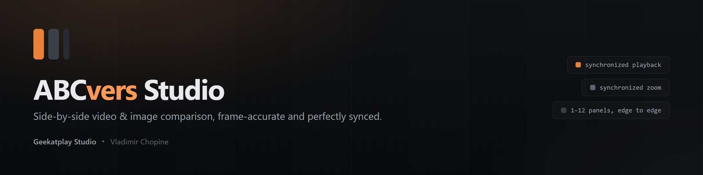
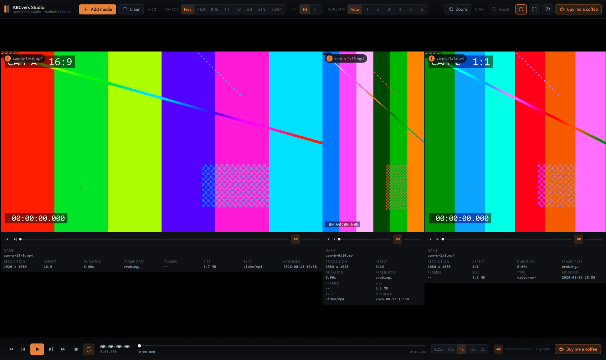
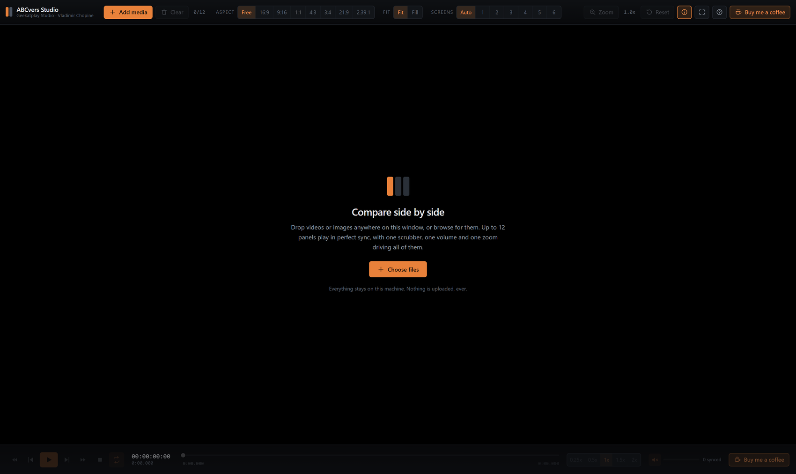
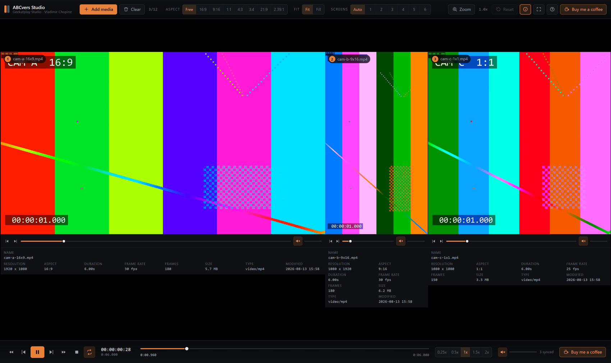
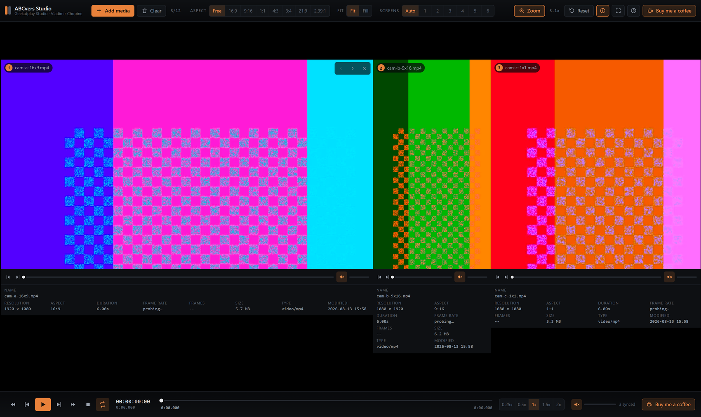
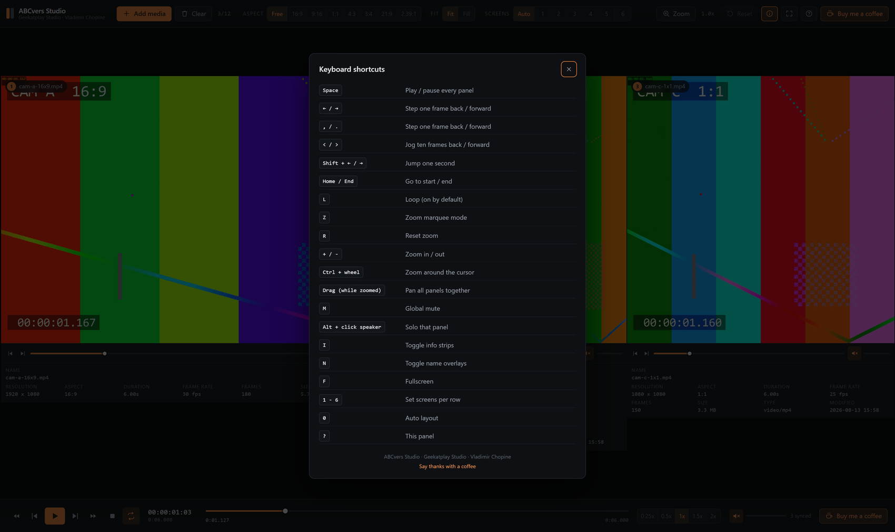

<div align="center">



**Side-by-side comparison for video and images.**
By **Geekatplay Studio** — *Vladimir Chopine*.

[](LICENSE)
[](#testing)
[](https://react.dev)
[](https://vitejs.dev)
[](tsconfig.json)

</div>

ABCvers Studio puts up to twelve clips or stills next to each other with no gaps
between them, and drives all of them from a single set of controls: one play
button, one scrubber, one volume, one zoom. Press play and every panel starts on
the same frame. Draw a marquee on any panel and every panel magnifies the same
region. That is the whole point of the tool — you are always comparing the same
moment, in the same place, at the same size.

Everything runs locally in your browser. **No file is ever uploaded anywhere.**



---

## Contents

- [Highlights](#highlights)
- [Screenshots](#screenshots)
- [Getting started](#getting-started)
- [Using the studio](#using-the-studio)
  - [Adding media](#adding-media)
  - [Layout and aspect ratio](#layout-and-aspect-ratio)
  - [Resizing panels](#resizing-panels)
  - [Synchronized playback](#synchronized-playback)
  - [Audio](#audio)
  - [Synchronized zoom](#synchronized-zoom)
  - [Media info](#media-info)
- [Keyboard shortcuts](#keyboard-shortcuts)
- [Supported formats](#supported-formats)
  - [HDR and log-encoded video](#hdr-and-log-encoded-video)
  - [EXR](#exr)
  - [DNG](#dng)
- [How it works](#how-it-works)
  - [The sync engine](#the-sync-engine)
  - [Synchronized zoom geometry](#synchronized-zoom-geometry)
  - [Layout maths](#layout-maths)
  - [Performance](#performance)
- [Guardrails](#guardrails)
- [Testing](#testing)
- [Project layout](#project-layout)
- [Scripts](#scripts)
- [Troubleshooting](#troubleshooting)
- [Support the work](#support-the-work)
- [Credits and licence](#credits-and-licence)

---

## Highlights

| | |
|---|---|
| **1–12 panels** | Any mix of videos and stills, side by side, pictures meeting edge to edge with nothing between them. |
| **Frame-accurate sync** | One transport drives every clip. Drift is corrected continuously. Loops by default. |
| **Frame by frame, either way** | Single and ten-frame jogs from the footer, from any panel, or from the keyboard. |
| **Synchronized zoom** | Marquee a detail in one panel; every panel magnifies the same region. |
| **Free or locked aspect** | Panels follow each source's own ratio, or lock all of them to 16:9, 9:16, 1:1, 4:3, 3:4, 21:9, 2.39:1 — with Fit or Fill. |
| **Resizable panels** | Drag the divider between any two panels to trade width. |
| **Per-panel + global audio** | Independent volume and mute per screen, multiplied by a master volume. Alt-click to solo. |
| **EXR and DNG, for real** | EXR is decoded and tone-mapped in the browser, with a live exposure slider. DNG previews the embedded JPEG every real-world RAW file already carries. Neither format has any native browser support - both are hand-written parsers. |
| **Full metadata** | Name, resolution, aspect, duration, frame rate, frame count, size, MIME type, modified date - plus true sensor size for a DNG. |
| **Drag and drop** | Drop files or whole folders anywhere on the window, or use the file picker. |
| **Dark, minimal UI** | Near-black chrome so the footage is the only saturated thing on screen. |
| **Fully local** | Object URLs only. Nothing leaves the machine. |

---

## Screenshots

All captured from the running app — three synthetic test clips at mixed
resolutions and orientations (16:9, 9:16, 1:1), so the geometry and the
frame-rate readouts on screen are real, not mocked up.

<table>
<tr>
<td width="50%">

**Cold start**
<br>Drop files anywhere, or browse. Nothing loaded, nothing uploaded.



</td>
<td width="50%">

**Playing, in sync**
<br>Three different sources, three different frame rates (30 fps, 30 fps,
25 fps — each measured, not assumed), one shared timecode.



</td>
</tr>
<tr>
<td width="50%">

**Synchronized zoom**
<br>One marquee, drawn once, on one panel — magnified identically in all
three at once. This is the feature the tool is built around.



</td>
<td width="50%">

**Everything is a shortcut**
<br>Full keyboard reference, always one `?` away.



</td>
</tr>
</table>

---

## Getting started

Requirements: **Node.js 18+** (built and verified on Node 22) and a modern
Chromium, Edge, Safari or Firefox build.

### Quick Start

```bash
git clone https://github.com/GeekatplayStudio/ABCvers-Studio.git
cd ABCvers-Studio
```

### Available scripts

Run shell scripts directly:

```bash
./scripts/install.sh
./scripts/start.sh
./scripts/stop.sh
```

Or via npm:

```bash
npm run app:install
npm run app:start
npm run app:stop
```

That is the whole workflow: **install once, then start and stop.**

### What each one does

**install** checks that Node is present and recent enough, then installs from
`package-lock.json` with `npm ci` for a reproducible tree.

| Option | |
|---|---|
| `-Update` / `--update` | Use `npm install` instead, letting the lockfile change |
| `-Verify` / `--verify` | Also typecheck, lint and run the full test suite |

**start** installs dependencies if they are missing, runs the production build
(**which typechecks first — a type error stops the start, it does not ship**),
then launches the server detached and waits until it is genuinely accepting
connections before telling you the URL. It records the process id and port in
`.abcvers/server.json` so `stop` can shut down exactly that server. Default port
**4173**.

| Option | |
|---|---|
| `-Port 8080` / `--port 8080` | Listen somewhere else |
| `-Dev` / `--dev` | Skip the build, run the hot-reloading dev server (port 5173) |
| `-SkipBuild` / `--skip-build` | Serve the existing `dist/` without rebuilding |
| `-Force` / `--force` | Stop a running instance and start fresh |
| `-NoOpen` / `--no-open` | Do not open a browser |

Start refuses to do damage: if an instance is already running it says so and
opens that one rather than starting a second, and if the port is taken it names
the process holding it instead of failing halfway through a build.

**stop** shuts down the recorded process. If that record is missing or stale —
machine rebooted, file deleted — it falls back to whatever is listening on the
port, and **only ever stops a `node` process**, never something unrelated that
happens to have taken the port.

| Option | |
|---|---|
| `-Port 8080` / `--port 8080` | Also release another port |
| `-All` / `--all` | Also release the dev port |

Server output goes to `.abcvers/server.log`; the whole `.abcvers/` directory is
scratch state and is git-ignored.

### Working on the code directly

```bash
npm run dev      # hot-reloading dev server at http://localhost:5173
npm run build    # typecheck, then bundle to ./dist
npm run serve    # serve ./dist on 4173
npm run verify   # typecheck + lint + tests
```

---

## Using the studio

### Adding media

Three ways, all equivalent:

1. **Drag and drop** files onto the window — anywhere, at any time, including
   while clips are already playing. Whole folders work too: the drop handler
   walks directory entries up to four levels deep.
2. **Add media** in the toolbar opens the file navigator (multi-select).
3. **Choose files** on the empty-state card, for a cold start.

New panels are appended to the right. A clip that joins while the others are
playing is dropped onto the current playhead and starts playing immediately, so
it is in sync from its first frame.

Close a panel with the **✕** in its top-right corner (visible on hover), or wipe
the session with **Clear**. Reorder panels with the **‹** and **›** buttons.

### Layout and aspect ratio

**Screens** picks how many panels sit in a row: `Auto`, or 1–6. `Auto` keeps up
to four panels on one row and wraps larger sets into a grid, always choosing the
arrangement that leaves each panel biggest.

**Aspect** controls the shape of every panel:

- **Free** — each panel takes exactly the aspect ratio of its own media.
- **16:9 / 9:16 / 1:1 / 4:3 / 3:4 / 21:9 / 2.39:1** — every panel is forced to
  the same frame shape, without distorting the picture. This is the mode for
  judging framing across differently shot sources.

**Fit / Fill** decides what happens when a panel is *not* the same shape as the
picture inside it — which only occurs under an aspect lock, or after you have
dragged a splitter:

- **Fit** shows the whole frame, letterboxing inside the panel. The default.
- **Fill** crops the picture so it reaches every edge of the panel, leaving no
  bars anywhere.

Switching aspect resets any widths you dragged by hand.

#### Pictures always meet edge to edge

Panels are not simply given equal or proportional widths — that would leave
black letterbox bars between neighbouring pictures. Instead, every panel in a row
is given the **same picture height**, and a width of `height x aspect ratio`, so
each panel's box is exactly the shape of the picture in it. A 16:9 clip beside a
1:1 clip in a 1200 px row comes out at 768x432 and 432x432: both full bleed,
sharing one top and bottom edge, meeting on a single shared vertical edge with
**nothing at all between them**.

The row's height is whichever is smaller: the height available, or the height
that makes the row exactly fill the width. Leftover space therefore ends up
*outside* the row — never between the panels. Panel widths are emitted as
integers derived from cumulative positions, so adjacent edges land on the same
whole pixel and no sub-pixel seam can show the background through.

### Resizing panels

Hover the seam between two panels — the cursor becomes a resize handle and a thin
accent line appears. Drag to trade width between those two panels; the rest of the
row never moves, because the pair's combined width is conserved. A panel can never
be collapsed below 8% of the pair.

A dragged panel is no longer its picture's own shape, so bars appear inside it —
switch to **Fill** to crop instead, or change the aspect to snap every panel back
to the automatic edge-to-edge widths.

The divider is also keyboard reachable: tab to it, then **←/→** (hold **Shift**
for larger steps).

### Synchronized playback

The footer is the master transport:

- **Play / pause** starts and stops every video at once.
- **Frame step** (◀▌ ▐▶) moves one frame in either direction on the master
  clip's grid. The outer double arrows jog **ten** frames at a time.
- **Stop** pauses and rewinds to the start.
- **Loop** restarts the timeline at the end instead of stopping. **On by
  default** — comparison work means watching the same few seconds over and over.
- **Speed** — 0.25x, 0.5x, 1x, 1.5x, 2x, applied to every clip together.
- **Master scrubber** seeks all panels. Dragging it pauses playback and resumes
  on release, so you never fight the playhead.
- **Timecode** shows `HH:MM:SS:FF` on the master clip's frame rate, with the
  total duration beneath it.

Each panel also has its **own frame-step buttons and compact scrubber**. They are
not an independent playhead — they show the shared position and move the whole
group, so you can jog frame by frame from whichever panel you happen to be
studying without reaching back down to the footer.

#### Moving frame by frame

Six ways, all of them bidirectional and all of them moving every panel together:

| Control | Movement |
|---|---|
| Footer ◀▌ / ▐▶ | One frame back / forward |
| Footer ◀◀ / ▶▶ | Ten frames back / forward |
| Panel ◀▌ / ▐▶ | One frame, from any panel |
| `←` / `→` | One frame back / forward |
| `,` / `.` | One frame back / forward (NLE convention) |
| `<` / `>` | Ten frames back / forward |

Stepping pauses playback first, then snaps onto the frame grid of the master
clip — landing at `(n + 0.5) / fps`, mid-frame, which is what browsers decode
reliably. Landing on a frame boundary gives you the neighbouring frame about
half the time.

The timeline length is the **longest** clip. Shorter clips park on their last
frame rather than looping or restarting, so the comparison stays honest.

### Audio

- Every panel has a speaker button and a volume slider.
- The footer has a **global** speaker and volume.
- What you hear from a panel is `panel volume x global volume`, and either mute
  silences it.
- **Alt-click a panel's speaker to solo it** — every other panel mutes. Alt-click
  again to bring them all back.

The studio starts **globally muted** on purpose: browsers block audible autoplay,
and twelve soundtracks at once is rarely what you want.

### Synchronized zoom

This is the feature the tool is built around.

1. Click **Zoom** in the toolbar (or press **Z**). The cursor becomes a crosshair.
2. **Drag a marquee** around the detail you care about, on any panel.
3. On release, that region is magnified to fill the frame — **in every panel at
   once**.

While zoomed (and out of marquee mode) the cursor is a hand: **drag to pan**, and
all panels pan together. **Ctrl/⌘ + scroll wheel** zooms around the pointer.
**Reset** (or **R**) returns to the original framing. The toolbar shows the live
magnification factor.

Zoom composes: drawing a second marquee while already zoomed magnifies further
into what you are currently looking at, and the maths accounts for the current
transform, so it lands exactly where you drew it.

Because the zoom region is stored in normalized picture coordinates rather than
pixels, it means "the same part of the image" regardless of each source's
resolution or each panel's on-screen size. A 4K master and a 720p proxy magnify
the identical region.

### Media info

Under each panel (toggle with **I**, or the info button):

| Field | Notes |
|---|---|
| **Name** | Middle-truncated so the extension stays visible; full name on hover. |
| **Resolution** | Intrinsic decoded pixels, e.g. `3840 x 2160`. |
| **Aspect** | Reduced ratio (`16:9`), or a decimal form for odd sizes (`1.78:1`). |
| **Duration** | Videos only. |
| **Frame rate** | Measured, not guessed — see below. Shows `probing…` until measured. |
| **Frames** | Total frame count, from duration x frame rate. |
| **Pixels** | Stills only — megapixels. |
| **Sensor** | DNG only, and only shown when it differs from Resolution — the true sensor capture size, versus the embedded preview actually on screen. |
| **Size** | File size on disk. |
| **Type** | MIME type — or `OpenEXR (HDR)` / `DNG (RAW preview)`, which are far more useful than the generic type browsers report for either. |
| **Modified** | Last-modified timestamp from the file. |
| **Error** | Only when the file could not be decoded, EXR-parsed, or DNG-parsed. |

Frame rate is **measured** rather than read from a header: no browser API exposes
a file's frame rate, so the studio watches `requestVideoFrameCallback` and takes
the median gap between presented frames, then snaps the result onto the nearest
standard broadcast rate (23.976, 24, 25, 29.97, 30, 48, 50, 59.94, 60, …). Medians
shrug off dropped frames. That needs a few real, decoded frames to work with,
which a freshly loaded, still-paused clip does not have - so the moment a clip's
metadata is ready, it plays silently and briefly (muted, a few frames' worth) to
get them, then rewinds to exactly where it was. You will see a short flash, and
then a correct reading, rather than "probing…" hanging until you press play.

That priming playback is deliberately run **one clip at a time**, queued
app-wide, however many clips were just dropped in together. Comparing several
clips side by side is the whole point of this tool, so they are almost always
loaded in a batch - and letting them all prime concurrently turned out to
starve each other's decoder time badly enough to corrupt the reading, not just
slow it down: four real 24fps clips added together, each fighting the others
for the same decoder, measured back as 12/12/18/18fps. One at a time, all four
read correctly. See the comment on `primeFps` in
[`src/lib/media.ts`](src/lib/media.ts) for the full story.

Browsers without the frame-callback API (Firefox) fall back to 30 fps, which
only affects frame stepping and the frame counter.

---

## Keyboard shortcuts

| Key | Action |
|---|---|
| `Space` / `K` | Play / pause every panel |
| `←` / `→` | Step one frame back / forward |
| `,` / `.` | Step one frame back / forward |
| `<` / `>` | Jog ten frames back / forward |
| `Shift + ←` / `→` | Jump one second |
| `Home` / `End` | Go to start / end |
| `L` | Loop (on by default) |
| `Z` | Zoom marquee mode |
| `Esc` | Leave marquee mode |
| `R` | Reset zoom |
| `+` / `-` | Zoom in / out |
| `Ctrl/⌘ + wheel` | Zoom around the cursor |
| Drag (while zoomed) | Pan all panels together |
| `M` | Global mute |
| `Alt + click` speaker | Solo that panel |
| `I` | Toggle info strips |
| `N` | Toggle name overlays |
| `F` | Fullscreen |
| `1` … `6` | Screens per row |
| `0` | Auto layout |
| `?` | Shortcut reference |

Shortcuts stand down automatically while a slider or a text field has focus.

---

## Supported formats

Whatever your browser can decode, plus two formats no browser decodes at all
that get their own hand-written support: **EXR** and **DNG**.

- **Video** — `.mp4`, `.m4v`, `.mov`, `.webm`, `.ogv`, plus `.mkv`, `.avi`,
  `.mpg`, `.ts` where the browser supports the container and codec.
- **Images** — `.png`, `.jpg`, `.webp`, `.gif`, `.avif`, `.bmp`, `.svg`, `.tif`.
- **EXR** — decoded and tone-mapped in the browser; see below.
- **DNG** — the embedded preview is extracted and shown; see below.

Files are classified by MIME type first and by extension as a fallback, because
exports out of an NLE frequently reach the browser with no MIME type at all -
doubly true for EXR and DNG, which browsers never assign a useful MIME type to
in the first place.

If a file is recognised but the browser cannot decode it (a ProRes `.mov`, an
H.265 file on an unsupported build), the panel stays in place and shows a clear
decode error rather than disappearing or breaking the session. The same is
true of an EXR using an unsupported compression, or a DNG with no embedded
preview - see the specifics below.

### HDR and log-encoded video

HDR (HDR10, HLG, Dolby Vision) and log-encoded footage (S-Log, V-Log, LogC,
C-Log, and so on) are ordinary video files as far as a browser is concerned -
whatever codec and gamma curve is inside an `.mp4`/`.mov`/`.mkv` plays back
exactly as encoded, with **no transform applied**. Log footage previews in its
native flat, desaturated look; HDR tone-mapping (if any) is entirely up to the
browser and the display, the same as it would be for any other page. This is a
deliberate choice, not a missing feature: a comparison tool should show you
what is actually in the file. There is no LUT or display-transform step in
this app.

### EXR

[`src/lib/exr.ts`](src/lib/exr.ts) is a from-scratch OpenEXR scanline reader -
there is no dependency-free way to get EXR decoding into a browser, so this
implements the parts of the format spec that cover the overwhelming majority
of real renders and plates:

- **Single-part scanline images.** Not tiled, not deep/multipart data - both
  fail immediately with a specific reason rather than a wrong or blank image.
- **Compression: none, RLE, ZIPS, ZIP.** PIZ, PXR24, B44, B44A, DWAA and DWAB
  are wavelet- or DCT-based and a materially larger undertaking than the
  byte-oriented schemes here; a file using one of them fails with the specific
  compression name in the error, not a generic parse failure.
- **The conventional `R`/`G`/`B`/`A` channels**, or a single `Y` luminance
  channel as a grayscale fallback. Additional AOV layers in a multi-layer EXR
  are not read.

Decoded pixels are scene-linear HDR floats - turning that into something a
screen can show is exposure adjustment (a plain `2^stops` multiply, via the
per-panel exposure slider that replaces the usual transport row for an EXR
panel) followed by Reinhard tone-mapping (`x / (x + 1)`) and an sRGB transfer
function. This is a reasonable, unsurprising default preview, not a
colour-managed viewer or a substitute for ACES - there is no LUT support and
no colour-space handling beyond that.

The result is drawn to a `<canvas>` (there is no `` involved at all for
an EXR panel), sized and positioned by the same layout system as every other
panel, so zoom, sync-scrubbing and edge-to-edge alignment all work identically
to a video or an ordinary image.

Every code path in the parser - all four compression schemes, both half and
float pixel data, alpha handling, multi-chunk scanline placement, and every
malformed-input case - is checked in `src/lib/exr.test.ts` against real EXR
files decoded independently by ffmpeg's own OpenEXR implementation, not
against this parser's own assumptions about what it should produce.

### DNG

DNG - and every RAW format built on it - stores sensor data that needs a real
demosaic/white-balance/colour pipeline to become a picture. Reproducing that
in a browser is a different, much larger project than a comparison tool, and
is out of scope here. What is in scope, and genuinely useful: DNG is TIFF
underneath, and virtually every real-world DNG already carries one or more
embedded JPEG previews for exactly this purpose - fast display without
touching the RAW data.

[`src/lib/dng.ts`](src/lib/dng.ts) walks the TIFF IFD structure (following
`SubIFDs` and the classic IFD chain, both of which real DNGs use) to find
every embedded JPEG and picks the largest one. The Media Info strip for a DNG
panel shows both that preview's own resolution (what is actually on screen)
and the true sensor capture size where the two differ, so it stays clear that
you are looking at a preview, not the full RAW. A DNG with no locatable
embedded preview fails with that specific reason rather than a blank panel.

No JPEG decoding happens in this file at all - once the byte range is found,
it becomes a plain `Blob`, gets an object URL, and is handed to an ordinary
``, the same as any other still.

---

## How it works

Stack: **React 18 + TypeScript + Vite**, **Zustand** for session state,
**Vitest + Testing Library** for tests. No UI framework, no chart library, no
runtime CSS-in-JS — the whole thing, EXR/DNG decoders included, is about 66 kB
gzipped.

### The sync engine

[`src/lib/sync.ts`](src/lib/sync.ts) is a standalone class that knows nothing
about React.

- **One master.** The longest ready clip owns the clock. Everything else is a
  follower, so the shortest clip cannot drag the group back.
- **One animation frame loop** drives correction and publishes the playhead.
- **Two-tier drift correction.** Under 12 ms of drift: do nothing (correcting is
  more disruptive than the error). Between 12 ms and 250 ms: trim the follower's
  `playbackRate` by ±6% until it catches up — inaudible and with no visual hitch.
  Beyond 250 ms: a hard seek. Naive implementations hard-seek constantly, which
  is exactly why they stutter.
- **Followers that are seeking or still buffering are left alone**, so the engine
  never fights the decoder.
- **Frame stepping** snaps onto frame centres (`(n + 0.5) / fps`), which is what
  browsers decode reliably; landing on a boundary gives you the wrong frame about
  half the time.
- Clips that join late are dropped onto the current playhead and started if the
  session is playing.
- **Looping restarts, it does not merely rewind.** A clip that reaches its end is
  paused by the browser, and drift correction deliberately never touches the
  master — so the loop explicitly re-issues `play()` on every element after
  rewinding. Seeking alone would leave the timeline sitting at zero.

The class takes its scheduler as a constructor argument, so tests advance frames
by hand instead of waiting on real time.

### Synchronized zoom geometry

[`src/lib/zoom.ts`](src/lib/zoom.ts) keeps a single normalized rectangle
(`x, y, w, h`, all 0–1) for the whole session, relative to each panel's **content
box** — the area the picture really occupies after letterboxing.

- `rectToTransform` turns it into a CSS transform that centres the selection and
  magnifies it as far as it can while keeping the **whole** selection visible, so
  you never lose part of what you deliberately drew. Translation is clamped so
  empty gutters can never appear at the edges.
- `viewToContent` is the exact inverse, which is what lets a marquee drawn while
  already zoomed compose correctly with the existing zoom.
- Everything is applied as a single `translate3d(...) scale(...)` on a wrapper
  element, so magnification is a GPU compositor operation — no re-decode, no
  re-layout, no canvas.

The synchronization property is a direct consequence of normalizing to content
rather than pixels, and it is asserted in the test suite: the same rect produces
the same relative framing in panels of different sizes.

### Layout maths

[`src/lib/layout.ts`](src/lib/layout.ts). `fitRow` is a pure function: given the
panel weights (each one a width-per-unit-height — the media ratio in free mode,
the locked ratio otherwise, or a splitter override), the row's box and the height
its info strips need, it returns one shared picture height plus integer widths.

```
H = min(availableHeight, rowWidth / Σ weights)
width_i = H × weight_i          (rounded off cumulative positions)
```

Because H is shared and each width is `H × ratio`, every box is exactly its
picture's shape. That is the whole mechanism behind edge-to-edge alignment, and
it is asserted both as arithmetic (`layout.test.ts`) and against the real DOM
geometry the components emit (`Stage.test.tsx`).

Info strips are measured with a `ResizeObserver` rather than assumed, because a
narrow panel wraps its metadata onto more lines; the row reserves the tallest
strip so one panel cannot push the pictures out of alignment. A splitter drag
conserves the dragged pair's total weight, so the rest of the row never jumps.

That reservation is deliberately **capped at half the row's height**
(`MAX_FOOTER_SHARE` in `layout.ts`), the fix for a real bug: the info strip's
own grid used to run out of columns and stack its fields on a narrow panel,
which grew the footer, which shrank the picture, which narrowed the panel
further, which stacked more fields - an unbounded collapse down to a sliver a
few dozen pixels wide. Five real portrait video panels (the kind this app
exists to compare) reproduced it exactly. Fixed on both ends: the info grid's
column count is now fixed rather than responsive, so its height stops
depending on panel width at all (see `.meta` in `global.css`), and the cap in
`fitRow` bounds the damage regardless, in case anything else in a footer ever
grows unexpectedly. `layout.test.ts` pins the cap's behaviour directly.

### Performance

The tool has to stay smooth with a dozen decoders running, so:

- **The playhead never enters React state.** Components subscribe to the sync
  engine and write CSS custom properties and `textContent` onto refs. Scrubbing a
  60 fps timeline triggers zero re-renders.
- **Zoom is a compositor transform**, not a redraw.
- **Panels are memoized**, and store reads are per-field selectors so a volume
  change in panel 3 does not re-render panels 1, 2 and 4.
- **ResizeObserver callbacks are coalesced into an animation frame**, with a
  sub-pixel threshold, so a splitter drag cannot storm the renderer.
- **Object URLs are revoked** the moment a panel closes.
- Audio is muted at the element level when the effective volume is 0, letting the
  browser skip audio decoding entirely.

---

## Guardrails

Defensive behaviour is concentrated in [`src/lib/guards.ts`](src/lib/guards.ts)
and covered by tests.

- **Hard panel limit** of 12; extra files are refused with a readable reason
  instead of grinding the machine to a halt.
- **File size ceiling** of 8 GB, and empty files are rejected.
- **Unsupported files never throw.** `intakeFiles` always returns
  `{ accepted, rejected }`, and rejections surface as a toast.
- **Every numeric input is coerced**: volumes clamp to 0–1, times clamp to the
  clip duration, frame rates outside 1–480 are discarded as probe artefacts, and
  `NaN` is handled everywhere rather than propagating into the DOM.
- **Zoom rects are clamped** to the unit square with a minimum size, and
  magnification is capped at 40x.
- **Marquee drags under 10 px are ignored**, so a click never zooms by accident.
- **A React error boundary** wraps both the app and the panel stage, so one bad
  file cannot take down the session.
- **Directory recursion is depth-limited** to four levels on drop.
- **A throwing subscriber cannot break the sync loop** — listeners are isolated.
- **Object URL creation failures** are caught per file.
- **EXR parsing fails with a specific reason, never a wrong image**: unsupported
  compression, tiled/deep/multi-part variants, an implausible data window
  (capped at 20000×20000), and a truncated file are all rejected explicitly
  rather than producing garbage pixels.
- **DNG IFD traversal is bounded** (48 IFDs) against a corrupt or adversarial
  file with a cyclic `SubIFDs`/next-IFD chain, and a candidate preview is only
  ever trusted after its bytes are checked for a real JPEG start-of-image
  marker — a corrupted offset fails cleanly instead of being handed to ``
  as if it were valid.

---

## Testing

```bash
npm test          # single run
npm run test:watch
npm run coverage  # v8 coverage report in ./coverage
```

**249 tests across 15 files**, all passing. The suite is weighted towards the
logic that is hard to eyeball:

| File | Covers |
|---|---|
| `lib/sync.test.ts` | Registration, master selection, transport, frame stepping, all three drift-correction tiers, short-clip parking, subscriber isolation, and looping: that it restarts rather than only rewinding, survives lap after lap, and brings a short clip back with it. Uses a fake video element and a manual frame scheduler, so drift and end-of-clip scenarios are exact and instant. |
| `lib/exr.test.ts` | The EXR decoder against **real EXR files** (in `lib/fixtures/`) covering every supported compression (none/RLE/ZIPS/ZIP) × both pixel formats (half/float), an alpha channel, and a 32-row multi-chunk gradient checked scanline by scanline for correct placement. Every expected pixel value came from ffmpeg's own independent OpenEXR decoder, not this parser's assumptions. Plus every malformed-input path (bad magic, tiled, deep, multi-part, unsupported compression) and the exposure/tone-map maths. |
| `lib/dng.test.ts` | The DNG/TIFF preview extractor against hand-built but structurally-correct TIFF fixtures: a single embedded JPEG, two chained IFDs (must pick the larger), a DNG-shaped file with `SubIFDs` (must skip the non-JPEG raw SubIFD while still reading its size as the true sensor resolution), big-endian byte order, no-preview and truncated-file failures, and a tampered offset that must not be mistaken for a real JPEG. |
| `lib/zoom.test.ts` | Rect clamping, marquee normalization, transform maths, gutter clamping, magnification cap, inverse round-trip, zoom composition, panning, letterbox/pillarbox content boxes — and an explicit assertion of the cross-panel synchronization invariant. |
| `lib/guards.test.ts` | Classification by MIME and by extension (including EXR/DNG), size and emptiness rejection, numeric coercion, `NaN` handling, image-decoder routing. |
| `lib/format.test.ts` | Byte scaling, clock and SMPTE timecode (including the floating-point edges that make `62.48` print `.479`), duration, aspect reduction, middle truncation. |
| `lib/media.test.ts` | File intake and EXR/DNG decoder routing, panel limit accounting, object-URL failures, frame-rate median and broadcast-rate snapping, aspect fallbacks, the priming probe itself (real samples, exact restoration, normal speed, autoplay-refused fallback, never two clips at once), and the `loadExr`/`loadDngPreview` fetch-to-decode orchestration against the same real fixtures. |
| `lib/layout.test.ts` | Auto columns, row chunking, aspect-derived weights, splitter conservation, and `fitRow`: shared height, integer edges, height- vs width-constrained rows, strip reservation, no overflow, and the footer-reservation cap that stops a tall info strip from shrinking a panel's picture without bound. |
| `components/Stage.test.tsx` | The edge-to-edge guarantee against the real DOM: a 16:9 and a 1:1 panel come out 768x432 and 432x432 sharing one height, widths summing to the full row; mixed orientations keep integer edges; locked aspect gives identical boxes; short rows are height-constrained; multi-row splitting. |
| `store/useStudio.test.ts` | Add/remove/reorder, URL revocation, metadata, zoom state, the volume/mute/solo matrix, layout state, toasts. |
| `components/*.test.tsx` | Scrubber, volume and exposure pointer/keyboard interaction and ARIA; media info rendering for video, stills, EXR, DNG, loading and error states. |
| `App.test.tsx` | Whole-shell integration: rendering panels, closing, reordering, layout, aspect and fit controls, zoom controls, rejection toasts, loop default, both coffee links, frame stepping from the footer and from panels, and every keyboard shortcut. |

`src/test/setup.ts` fills the jsdom gaps — media playback, object URLs,
`ResizeObserver`, pointer capture, and a `PointerEvent` polyfill (without which
jsdom silently drops `clientX` and every drag test reads position zero).

---

## Project layout

```
docs/
  images/                 Banner, screenshots, social preview, icon
scripts/
  common.sh              Node check, port probing, server state
  install.sh             Dependency install
  start.sh               Build + serve, detached, with a health wait
  stop.sh                Shut down by recorded pid, port as fallback
  run.mjs                npm run app:* dispatcher
src/
  types.ts                 Shared domain types
  main.tsx                 Entry point
  App.tsx                  Shell: toolbar, stage, transport, overlays
  lib/
    sync.ts                SyncEngine - one timeline for every clip
    zoom.ts                Normalized zoom rects and transform maths
    layout.ts              Columns, rows, and the edge-to-edge row fit
    media.ts               File intake, metadata probing, fps measurement
    exr.ts                 From-scratch OpenEXR scanline decoder + tonemap
    dng.ts                 TIFF/DNG embedded-preview extraction
    guards.ts              Limits, classification, numeric coercion
    format.ts              Display formatters
    fixtures/              Real EXR files + hand-built DNG/TIFF files, for tests
  store/
    useStudio.ts           Zustand session state (no playhead - see above)
  hooks/
    useElementSize.ts      Coalesced ResizeObserver
    useMaxHeight.ts        Tallest info strip in a row
    useDropTarget.ts       Window-wide drag and drop, folders included
    useShortcuts.ts        Keyboard map
    useSyncTime.ts         Render-free playhead subscription
  components/
    Toolbar.tsx            Media, aspect, fit, columns, zoom, view
    Stage.tsx              Rows, justified panel geometry, splitters
    MediaPanel.tsx         One screen: media, tools, scrubber, volume, info
    MediaSurface.tsx       Content box, zoom transform, marquee and pan
    Scrubber.tsx           Ref-driven timeline control
    VolumeControl.tsx      Speaker + level
    ExposureControl.tsx    EXR exposure slider, centred on zero
    MediaInfo.tsx          Metadata strip
    TransportBar.tsx       Master transport
    EmptyState.tsx         Cold start
    CoffeeLink.tsx         Support link, shown top and bottom
    ShortcutsDialog.tsx    Keyboard reference
    Toasts.tsx             Non-blocking notices
    ErrorBoundary.tsx      Last-resort guardrail
    Icons.tsx              Slim SVG icon set
  styles/global.css        Design tokens and all component styling
  test/setup.ts            jsdom shims
```

---

## Scripts

| Script | Purpose |
|---|---|
| `./scripts/install.sh` / `npm run app:install` | Install dependencies |
| `./scripts/start.sh` / `npm run app:start` | Build and serve, detached |
| `./scripts/stop.sh` / `npm run app:stop` | Stop the server |
| `npm run dev` | Dev server with hot reload |
| `npm run build` | Typecheck, then bundle to `./dist` |
| `npm run preview` | Serve the built bundle |
| `npm run serve` | Serve `./dist` on port 4173 |
| `npm test` | Run all tests once |
| `npm run test:watch` | Tests in watch mode |
| `npm run coverage` | Coverage report |
| `npm run typecheck` | `tsc --noEmit` |
| `npm run lint` | ESLint |
| `npm run verify` | Typecheck + lint + tests |

---

## Troubleshooting

**`start` says the port is already in use.** Something else has 4173. Run
`./scripts/stop.sh`, or start elsewhere with `--port 8080`.

**`start` fails during the build.** That is the typecheck refusing to ship a
broken bundle — the error above the failure is the real one. `--skip-build` will
serve the last good `dist/` if you need the app up right now.

**`stop` says nothing was running but the browser still loads the page.** You are
looking at a cached tab, or a server started some other way. `./scripts/stop.sh --all`
releases both the preview and dev ports.

**A panel shows "could not be decoded".** The browser has no decoder for that
codec or container — ProRes, DNxHD, H.265 on some builds, or 10-bit sources.
Transcode to H.264/MP4 or VP9/WebM.

**An EXR panel shows an error naming a compression type (PIZ, PXR24, B44,
B44A, DWAA, DWAB).** Only none/RLE/ZIPS/ZIP compression are supported — see
[EXR](#exr). Re-export the file with one of those instead.

**A DNG panel shows "no embedded JPEG preview found".** Full RAW decoding is
out of scope — see [DNG](#dng) — and this particular file has no usable
embedded JPEG to fall back to, which is unusual but does happen with some
lossless-only or minimal DNG variants. There is no workaround short of
exporting a JPEG/PNG from the RAW file yourself.

**A `.braw`, `.r3d`, `.ari`, or `.mxf` file is rejected outright.** These are
proprietary camera-RAW-video or broadcast-wrapper formats with no browser
decoder anywhere, on any platform — unlike EXR/DNG there is no embedded
preview convention to fall back to, so they are not in the accepted list at
all. Export a comparison-friendly proxy (H.264/ProRes in an `.mp4`/`.mov`)
first.

**Frame rate says `probing…` for more than a couple of seconds.** It resolves
itself automatically the moment the clip has decoded a handful of frames, even
without you pressing play (see [Media info](#media-info)) - but that probe runs
one clip at a time app-wide, so if you dropped in a big batch, the later panels
are simply waiting their turn behind the earlier ones. If it hangs well beyond
that, the file at the front of the queue is decoding unusually slowly. In
Firefox the frame-callback API is missing entirely and the studio falls back
to 30 fps.

**No sound.** The studio starts globally muted by design. Unmute in the footer,
then check the panel's own speaker.

**I still see black bars around a picture.** Either an aspect lock is on, or you
dragged a splitter — in both cases the panel is no longer the picture's shape.
Switch **Fit** to **Fill** to crop instead, or set **Aspect** back to **Free**,
which also clears any widths you dragged.

**Panels drift on very large files.** Drift correction runs continuously, but a
decoder that cannot keep up with, say, four 4K streams will fall behind faster
than it can be nudged. Use proxies for heavy comparisons, or fewer panels.

**Frame stepping lands on the wrong frame.** Stepping uses the master clip's
measured rate. If clips have different frame rates, step on the timeline of the
longest one — that is the master.

---

## Support the work

If ABCvers Studio saves you time, you can say thank you with a small gift:

**☕ [geekatplay.gumroad.com/coffee](https://geekatplay.gumroad.com/coffee)**

The link sits in the top toolbar and the bottom transport bar, so it is always
one click away — and never in the way of the work.

---

## Credits and licence

**ABCvers Studio** — designed and built for **Geekatplay Studio**.
Concept and direction: **Vladimir Chopine**.

GitHub Repository: [github.com/GeekatplayStudio/ABCvers-Studio](https://github.com/GeekatplayStudio/ABCvers-Studio)

Released under the MIT Licence.

<sub>The link-preview card GitHub shows for this repo is set from
`docs/images/social-preview.png` via **Settings → General → Social preview** —
that's an upload done through the GitHub UI, not a file GitHub picks up on its
own.</sub>
